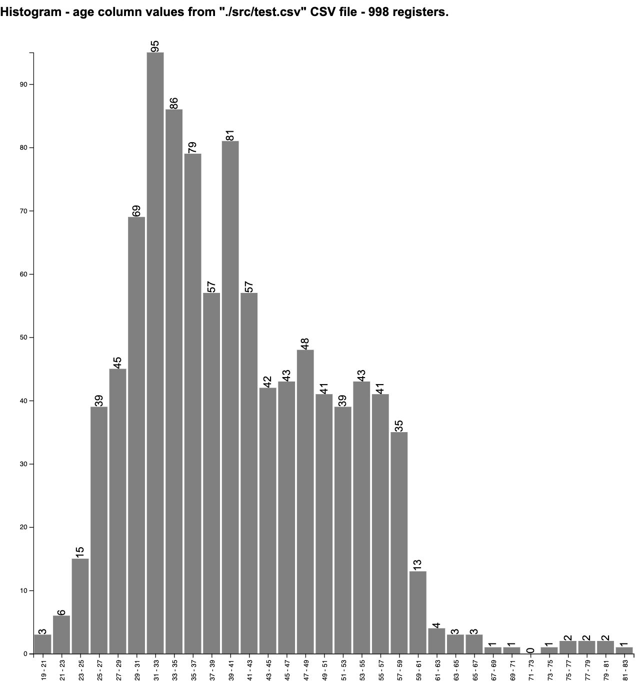
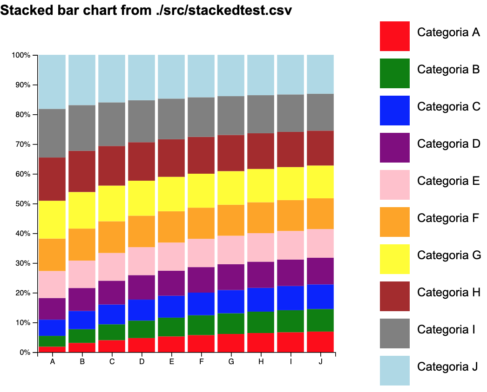

# Data Visualization

This repo is used to keep the practical exercicies made during the course of the subject Data Visualization of my Master Degree course in Computing. It consists in some applications to generate different kinds of charts. 

This project uses the [D3.js](https://d3js.org) libraries to build the charts.

In order to use this project it's necessary to have a web server to put your files. If you do not have one, or if you do not have much expirience on it, I recomend the use of the [Web Server for Chrome](https://chrome.google.com/webstore/detail/web-server-for-chrome/ofhbbkphhbklhfoeikjpcbhemlocgigb). It is a really simple to use local web server created as a Google Chrome browser extension. 

To use the library, follow the steps bellow: 

1. Download or clone the repo. 
2. Add your CSV file in the project folder.
3. Start your web server pointing to the project folder.
3. Open the index.html in your browser.
4. Select the chart type you want and follow the specific steps for chosen type in the corresponding section of this document.

## Histogram

### What is a histogram? 

It's a kind of chart that allows us to perceive, in a visual way, the frequency distribution of a data set.

### How is it generated?

The histogram algorithm implemented here follows the next steps:

1. Given a list of numerical values, it gets the greatest (G) and the lowest (L) values of it.
2. It calculates the amplitude (A = G - L).
3. It calculates the number of sections of the chart (K = squareRootOf(totalOfNumericalValues) ). There are more than one manner of doing this especific step, but for this project the square root was used. 
4. It calculates the range of each section (R = A / K).
5. It counts how many values are in each group.
6. It generates the chart. 

### How to use? 

 -  Enter with the data necessary to generate the chart.
     - The path to your CSV file.
     - The position of the column that contains the values to generate the chart (it starts in 0).
     - The width and the height.
     - Press "Generate".
    
#### Exemple of a histogram chart generated with the lib

## Stacked Bar Chart

### What is a histogram? 

It's a kind of chart that allows us to see the total values for different categories, at the same time that allows us to understand how each of these values is composed. With that it's possible to separate each value of each category in sub groups.

### How is it generated?

The histogram algorithm implemented here follows the next steps:

1. Given a table in the format: 

### How to use? 

    
#### Exemple of a histogram chart generated with the lib

